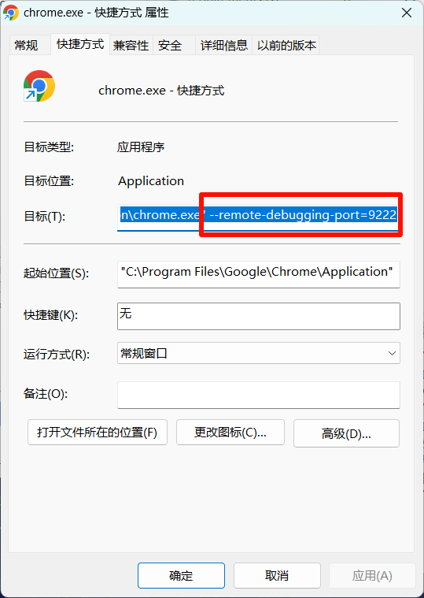

# auto-yuketang-watcher
 雨课堂自动开多个页面刷视频，直到刷完

1. 用微软浏览器或者谷歌浏览器搞一个快捷方式,属性,目标，绑定端口如下图
   参考："C:\Program Files\Google\Chrome\Application\chrome.exe" --remote-debugging-port=9222
     
2. 用这个快捷方式登录账号
3. 打开所要刷的课程页面
4. 运行脚本

注意：
1. 只能刷一个页面，期间会自动过选题，刷完会自动跳下一个视频
2. 有可能会弹出验证码，需要手动过一下验证码，然后再运行脚本重新刷，大概二三十个视频才一次验证码,这个规律也没摸索清楚